# Primary eBrem Track-ID and Radius Study

This note summarizes a focused scan of the baseline true Geant4 material-step tuples:

```text
gsf_material_steps-e--1.0-85-{1..10}.root
tree: g4step_tuple
sample: 1000 e-, 1 GeV, theta=85 deg
```

Selection definitions:

```text
eBrem step: process_subtype == 3
primary electron eBrem: process_subtype == 3 && track_id == 1 && parent_id == 0 && pdg == 11
radius coordinate: mid_r, in mm
```

The classification is **step-wise**. Each `g4step_tuple` entry is one event, while branches such as `track_id`, `parent_id`, `pdg`, `process_subtype`, `material`, `pre_volume`, `mid_r`, and `loss` are vectors with one element per recorded Geant4 step. The analysis loops over step index `i` inside each event and classifies that individual step:

```cpp
for each event:
  for each step i:
    if process_subtype[i] == 3      // eBrem
       && track_id[i] == 1          // primary Geant4 track
       && parent_id[i] == 0
       && pdg[i] == 11:
         classify this one step using material[i] and pre_volume[i]
         fill spectra with loss[i]
```

Thus the labels `crystal_bar`, `w_beampipe_shell`, and `other_tracker` are assigned per material step, not per event and not per whole track.

## Main Conclusions

1. `eBrem` does not usually change the electron track id. For primary electron eBrem, 31988 / 31991 steps have a later step with the same `track_id=1`, and 31988 / 31991 have the immediate next recorded step with the same track id. The brems photon is a secondary, but the charged electron normally continues as the same Geant4 track.

2. Primary-electron eBrem is dominated by a large-R peak near `R = 1.8-1.9 m`. The primary eBrem midpoint-radius median is `1856.5 mm`; 90.8% of primary eBrem steps are at `R >= 1000 mm`.

3. The smaller peak around `R = 100 mm` is real material, not a track-id artifact. In the `60 <= R < 120 mm` band, the median `R` is `102.9 mm`, but the median `z` is `833.9 mm`. This is not the first outward crossing near the IP; it is a later helical return to small R in the forward/MDI region.

4. The `R ~ 100 mm` peak is mainly high-Z/support material:

```text
G4_W             661 steps   BeamPipe_BeforeCryoW
stainless_steel 260 steps   LumiCal slices
LYSO              95 steps   LumiCal
CrZrCu18150       64 steps   BeamPipe_AntiSolenoid1
CFRP_M55J         43 steps   VXD shell
```

This means the `R ~ 100 mm` eBrem population should likely be separated from thin tracker-layer material when fitting a CEPC tracker-specific Bethe-Heitler model.

## Key Numbers

From `summary.txt`:

```text
events: 1000
all eBrem steps: 386315
all eBrem with same track later: 385330
primary eBrem steps: 31991
primary eBrem with same track later: 31988
primary eBrem with immediate same track: 31988

primary eBrem mid-R q25/q50/q75: 1840.7 / 1856.5 / 1878.0 mm
R100 primary eBrem count: 1155
R100 mid-R q10/q50/q90: 72.1 / 102.9 / 109.2 mm
R100 mid-z q10/q50/q90: 688.4 / 833.9 / 1019.0 mm
R100 step_tX0 mean/q50/q90: 0.0928 / 0.0632 / 0.2230
R100 hard loss >1%: 863 / 1155
R100 hard loss >10%: 376 / 1155
```

## Plots

Primary and all-eBrem radius distribution:

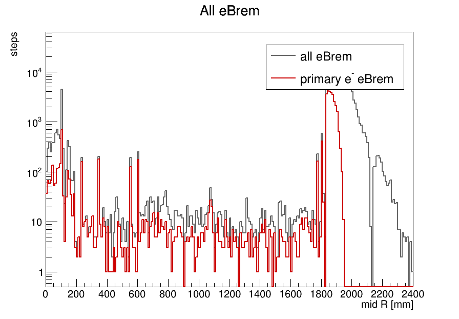

Inner/MDI zoom showing the `R ~ 100 mm` peak:

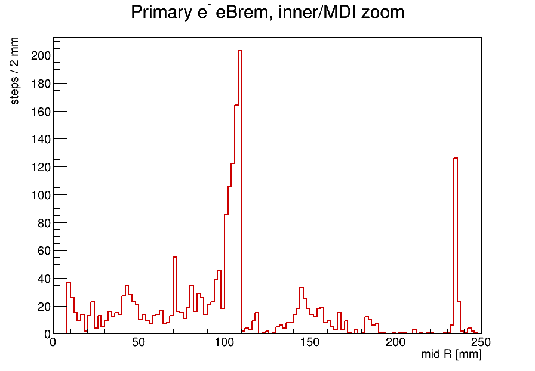

Primary eBrem `R` vs `z`, showing that the `R ~ 100 mm` population is forward in z rather than near the IP:

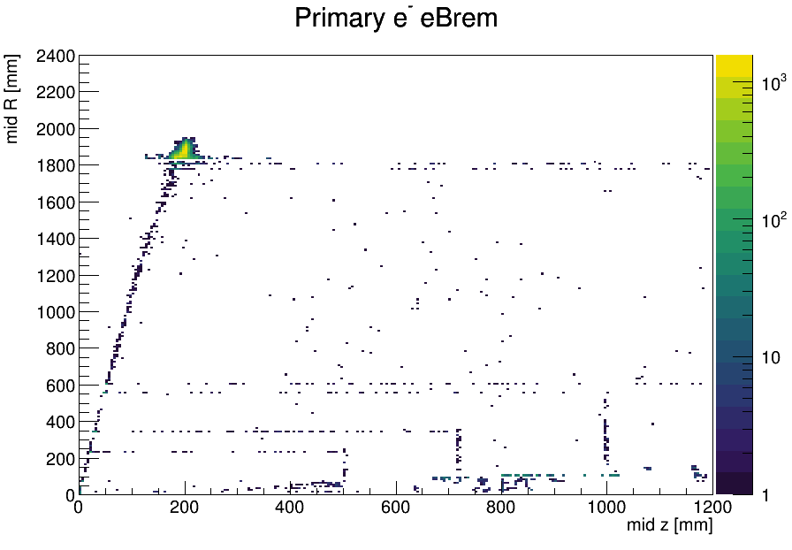

Zoom for `60 < R < 120 mm`:

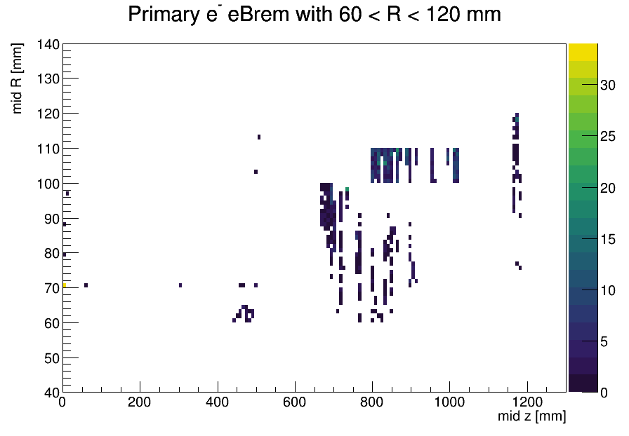

Material breakdown for `60 < R < 120 mm`:

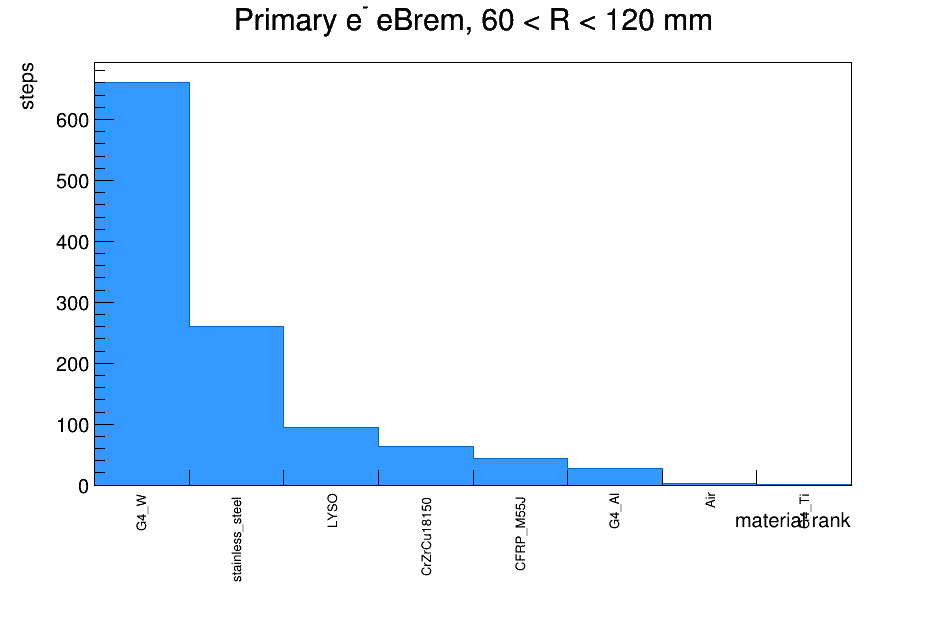

## Reproduction

Run from the CEPCSW top directory after the ROOT/CEPCSW environment is set:

```bash
root -l -b -q 'G4MaterialStepComparison/studies/e1p0_theta85/scripts/analyze_ebrem_trackid_r.C("G4MaterialStepComparison/studies/e1p0_theta85")'
```

Outputs:

```text
G4MaterialStepComparison/studies/e1p0_theta85/summary.txt
G4MaterialStepComparison/studies/e1p0_theta85/plots/*.png
G4MaterialStepComparison/studies/e1p0_theta85/plots/*.pdf
```

## Category Energy-Loss Spectra

Additional plots compare the primary-electron `eBrem` energy-loss spectra for three mutually exclusive material/volume categories:

```text
crystal_bar:       material == G4_BGO and pre_volume starts with bar_s or contains crystal_s
w_beampipe_shell:  material == G4_W and pre_volume contains BeamPipe_BeforeCryoW
other_tracker:     pre_volume contains VXD/ITK/TPC/OTK/SIT/SET, excluding the previous categories
```

The category summary is stored in:

```text
category_energy_loss_summary.txt
```

Key numbers:

```text
crystal_bar count 16072
  fractional loss mean/q50/q90/q99 = 0.1278 / 0.0455 / 0.3801 / 0.8645
  hard loss >1% / >10% = 12047 / 5539

w_beampipe_shell count 661
  fractional loss mean/q50/q90/q99 = 0.1327 / 0.0463 / 0.4262 / 0.8749
  hard loss >1% / >10% = 500 / 224

other_tracker count 1817
  fractional loss mean/q50/q90/q99 = 0.0717 / 0.0058 / 0.2293 / 0.8567
  hard loss >1% / >10% = 797 / 314
```

Overlay of fractional energy-loss spectra:

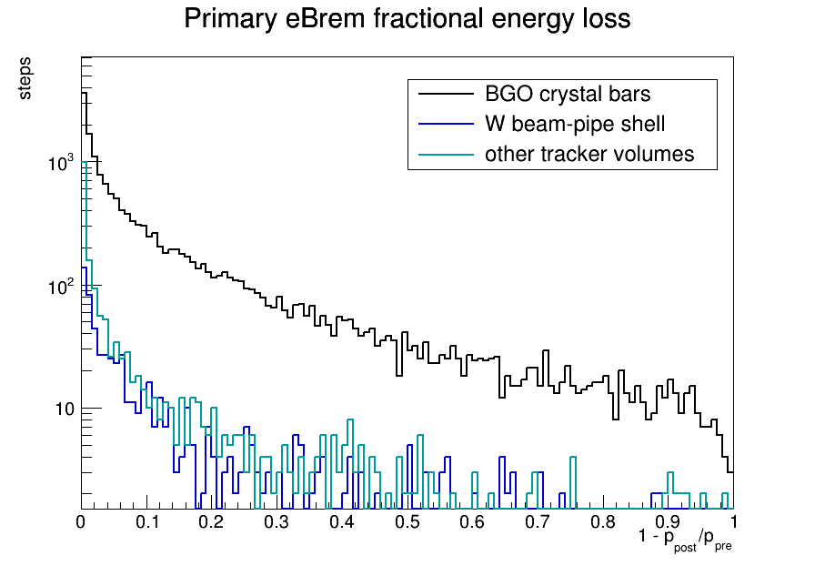

Shape-normalized fractional spectra:

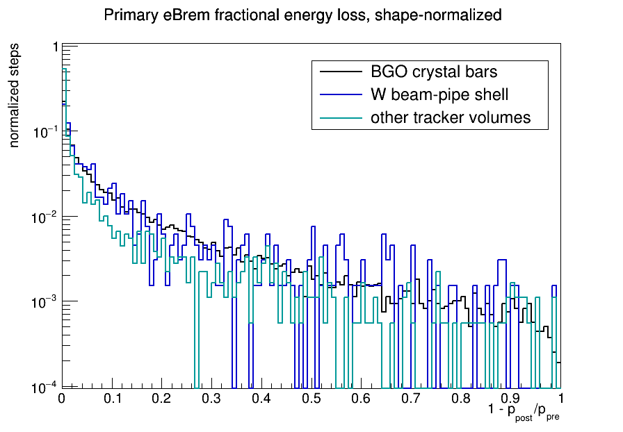

Absolute momentum-loss spectra:

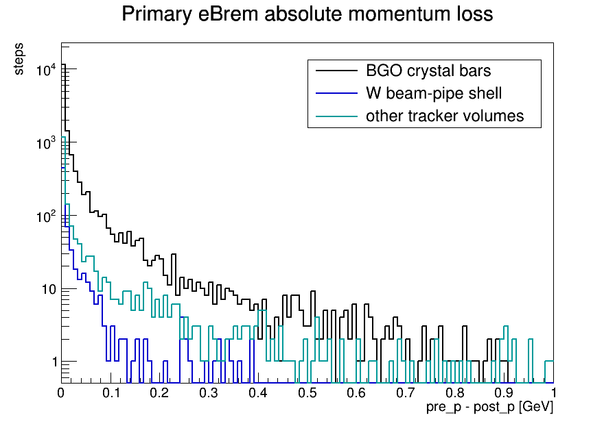

Separate fractional spectra:

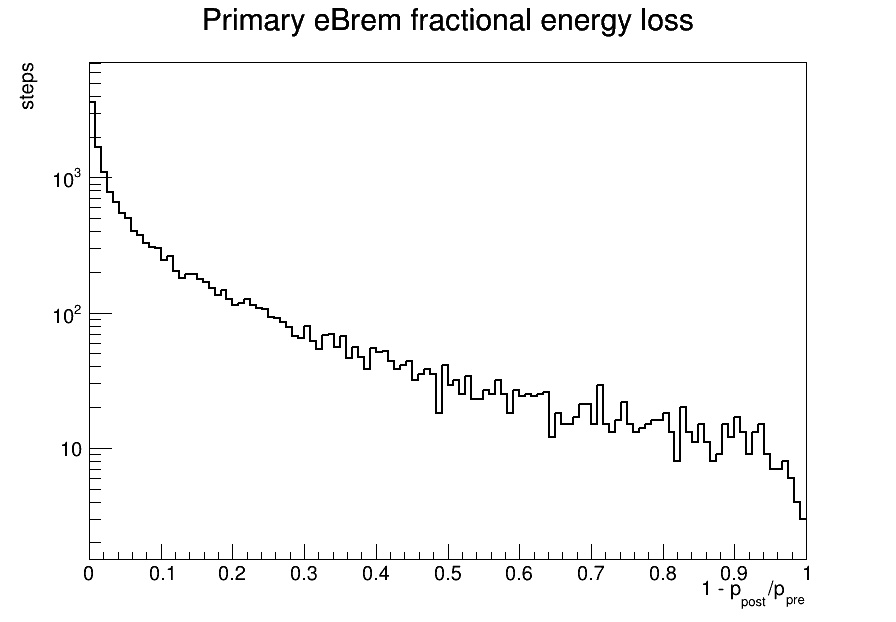

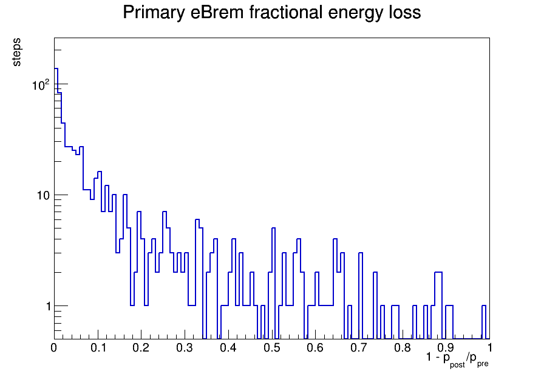

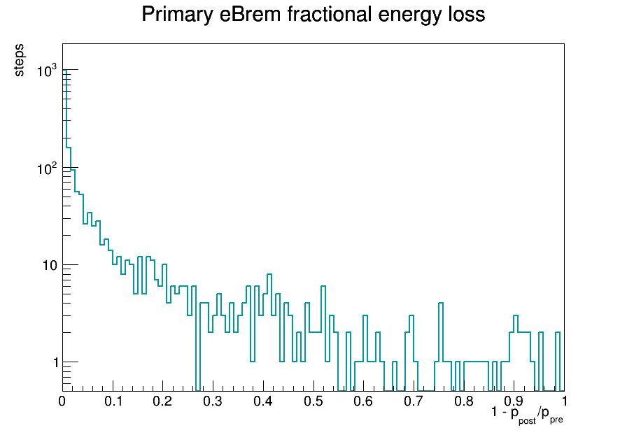

Primary electron eBrem in tracker-named volumes, shape-normalized `E_f/E_i = post_p/pre_p` spectrum:

```text
tracker_Ef_over_Ei_count 1817  mean 0.928326  q10 0.770737  q50 0.994173  q90 0.999880
```

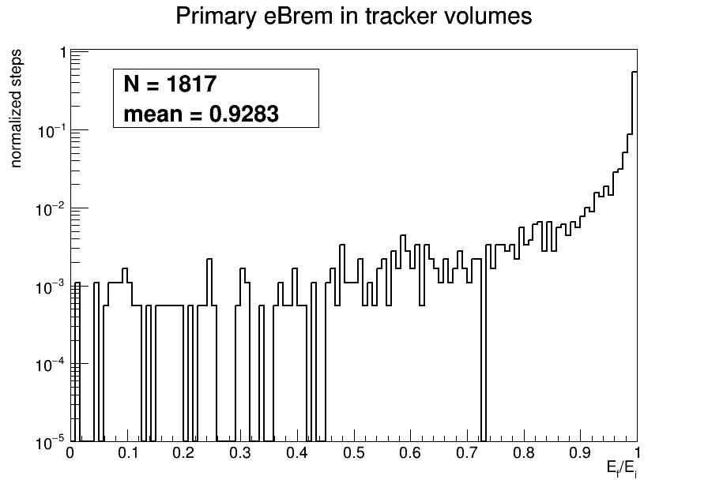

The same normalized histogram is saved for downstream studies in `plots/primary_tracker_ebrem_Ef_over_Ei_shape.root` as `h_primary_tracker_ebrem_Ef_over_Ei_shape`.

Reproduce these category spectra with:

```bash
root -l -b -q 'G4MaterialStepComparison/studies/e1p0_theta85/scripts/plot_ebrem_energy_loss_categories.C("G4MaterialStepComparison/studies/e1p0_theta85")'
```

## Tracker-Only Loss Spectra By Process

For all other energy-loss processes, the comparison is restricted to primary electron steps in tracker-named volumes:

```text
primary electron: track_id == 1 && parent_id == 0 && pdg == 11
tracker volume: pre_volume contains VXD/ITK/TPC/OTK/SIT/SET
loss variable: branch `loss` in GeV
```

Processes observed in this tracker selection are `eBrem`, `eIoni`, `msc`, `StepLimiter`, and `Transportation`.

Summary file:

```text
tracker_process_loss_summary.txt
```

Key numbers:

```text
eBrem          count 1817    mean 4.892e-2 GeV   q50 2.09e-3   q90 1.46e-1
eIoni          count 35628   mean 8.230e-5 GeV   q50 2.71e-6   q90 1.35e-5
msc            count 1310    mean 2.463e-5 GeV   q50 1.44e-5   q90 5.02e-5
StepLimiter    count 35384   mean 3.381e-6 GeV   q50 2.28e-6   q90 3.67e-6
Transportation count 910035  mean 5.759e-6 GeV   q50 8.30e-7   q90 9.89e-6
```

Overlay, raw counts:

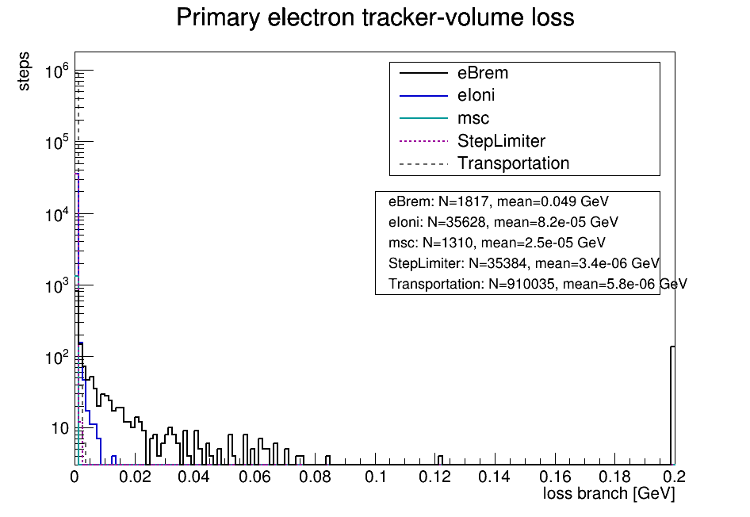

Overlay, shape-normalized:

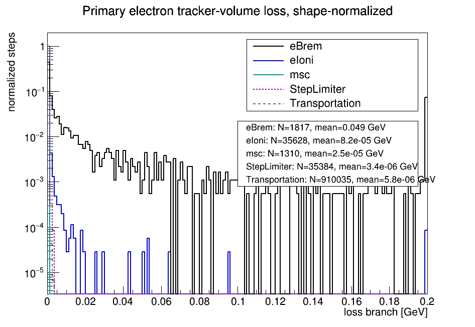

Individual process spectra:

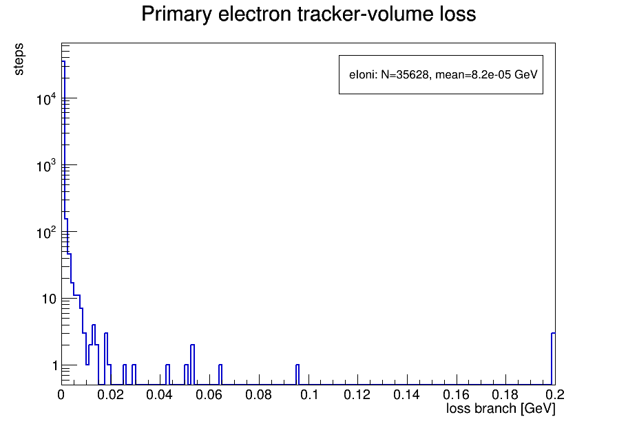

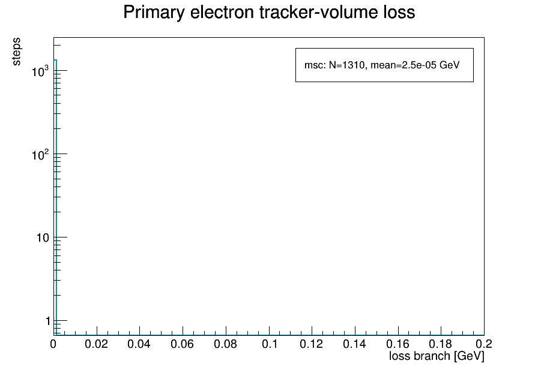

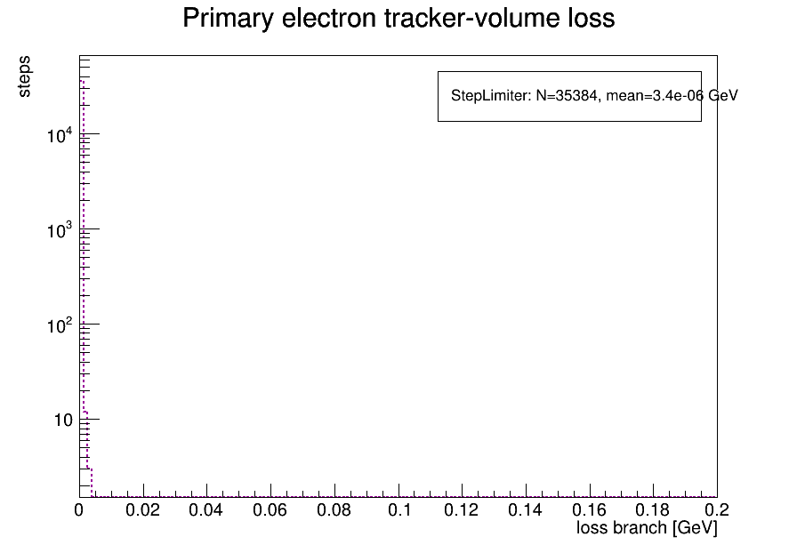

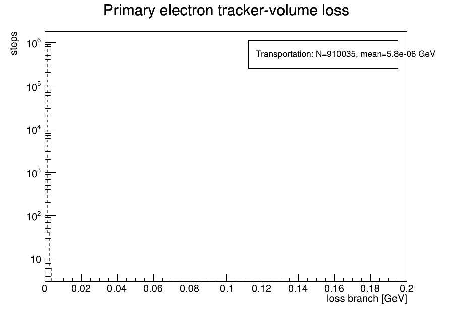

Reference tracker eBrem spectrum:

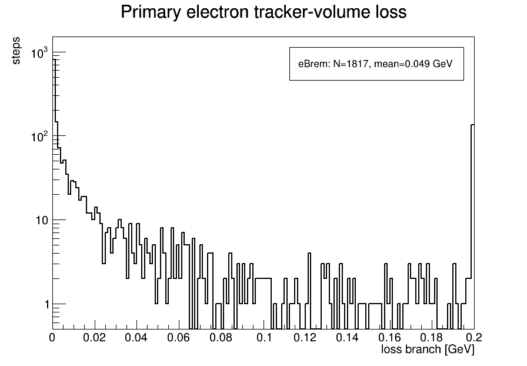

Reproduce these tracker-process spectra with:

```bash
root -l -b -q 'G4MaterialStepComparison/studies/e1p0_theta85/scripts/plot_tracker_process_loss_spectra.C("G4MaterialStepComparison/studies/e1p0_theta85")'
```

## Tracker eIoni vs muIoni Comparison

The same step-wise tracker-volume method is used to compare electron and muon ionization loss spectra:

```text
electron sample: gsf_material_steps-e--1.0-85-{1..10}.root
muon sample:     gsf_material_steps-mu--1.0-85-{1..10}.root
primary step:    track_id == 1 && parent_id == 0
tracker volume:  pre_volume contains VXD/ITK/TPC/OTK/SIT/SET
loss variable:   branch `loss` in GeV
eIoni/muIoni:    process_subtype == 2, with pdg == 11 for electron and pdg == 13 for muon
```

Although both ionization processes use `process_subtype == 2`, the process string check confirms the electron sample records `eIoni` and the muon sample records `muIoni`.

Summary file:

```text
tracker_electron_muon_ioni_summary.txt
```

Key numbers:

```text
eIoni  count 35628  mean 8.230e-5 GeV  q50 2.71e-6  q90 1.35e-5  q99 8.64e-4
muIoni count 21674  mean 5.209e-5 GeV  q50 2.50e-6  q90 1.47e-5  q99 1.05e-3
```

Raw count overlay:

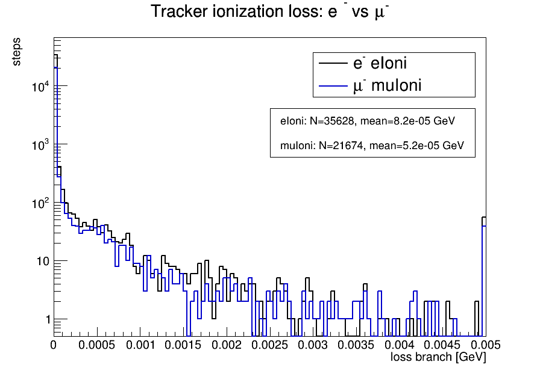

Shape-normalized overlay:

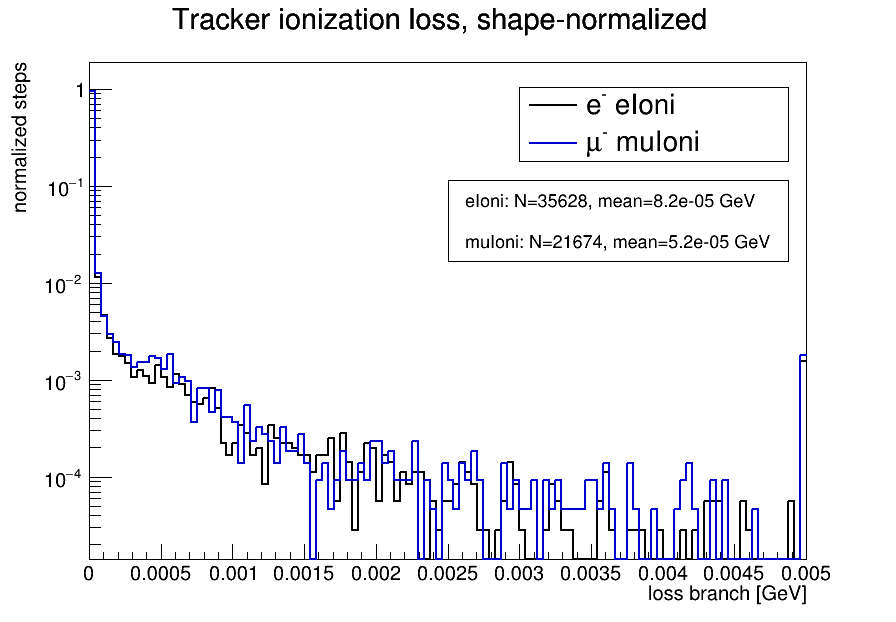

Reproduce with:

```bash
root -l -b -q 'G4MaterialStepComparison/studies/e1p0_theta85/scripts/plot_electron_muon_ioni_tracker_loss.C("G4MaterialStepComparison/studies/e1p0_theta85")'
```

## Muon Tracker-Only Loss Spectra By Process

The same step-wise tracker-volume process comparison is available for the 1 GeV, theta=85 deg muon sample:

```text
muon sample:     gsf_material_steps-mu--1.0-85-{1..10}.root
primary muon:    track_id == 1 && parent_id == 0 && pdg == 13
tracker volume:  pre_volume contains VXD/ITK/TPC/OTK/SIT/SET
loss variable:   branch `loss` in GeV
```

Observed primary-muon tracker processes are `muIoni`, `StepLimiter`, `Transportation`, and a tiny zero-loss `other` category.

Summary file:

```text
muon_tracker_process_loss_summary.txt
```

Key numbers:

```text
muIoni         count 21674   mean 5.209e-5 GeV  q50 2.50e-6  q90 1.47e-5  q99 1.05e-3
StepLimiter   count 11391   mean 1.989e-6 GeV  q50 1.67e-6  q90 3.10e-6  q99 8.19e-6
Transportation count 617346 mean 6.707e-6 GeV  q50 6.00e-7  q90 1.18e-5  q99 1.25e-4
other         count 4       mean 0
```

Overlay, raw counts:

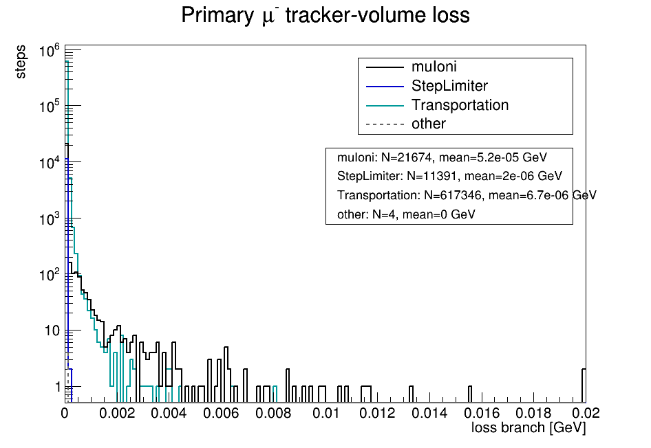

Overlay, shape-normalized:

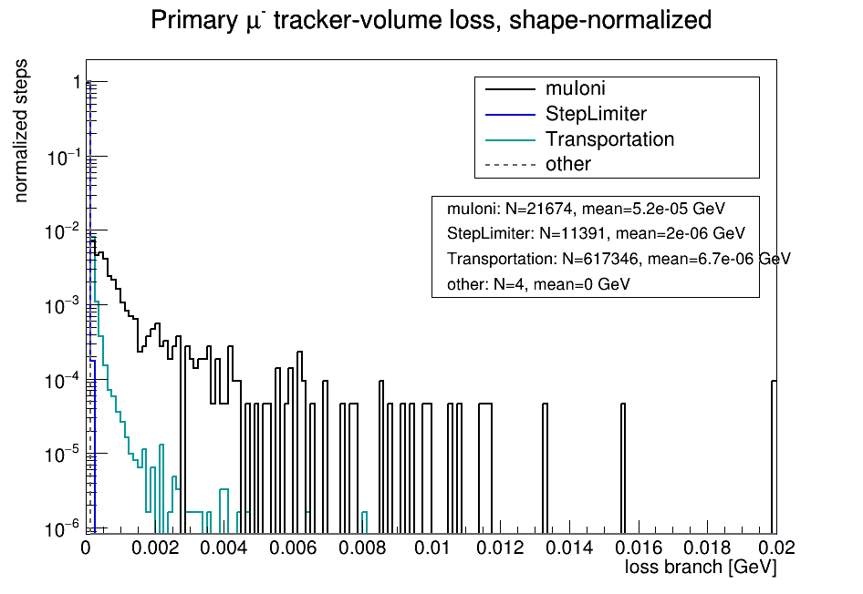

Individual process spectra:

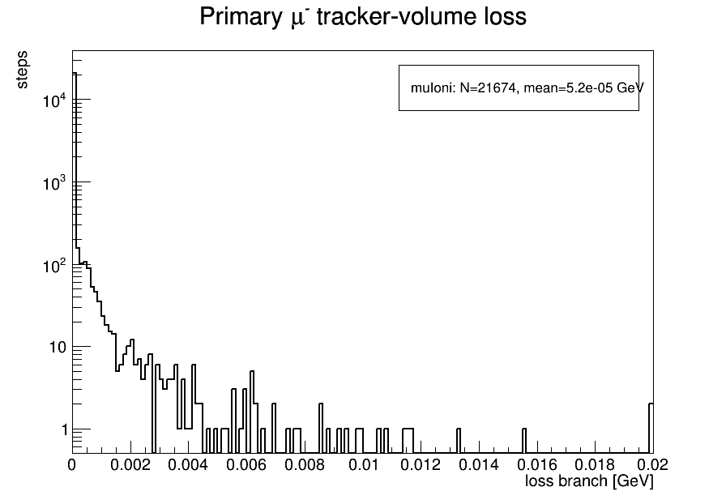

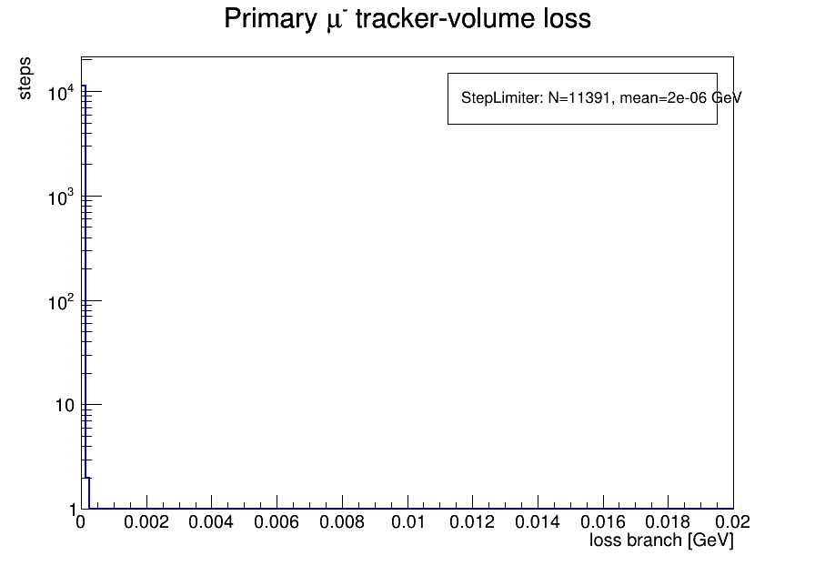

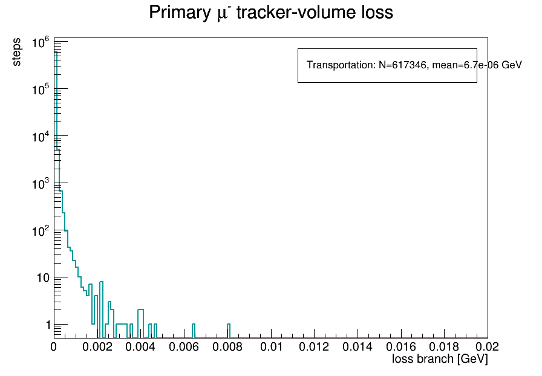

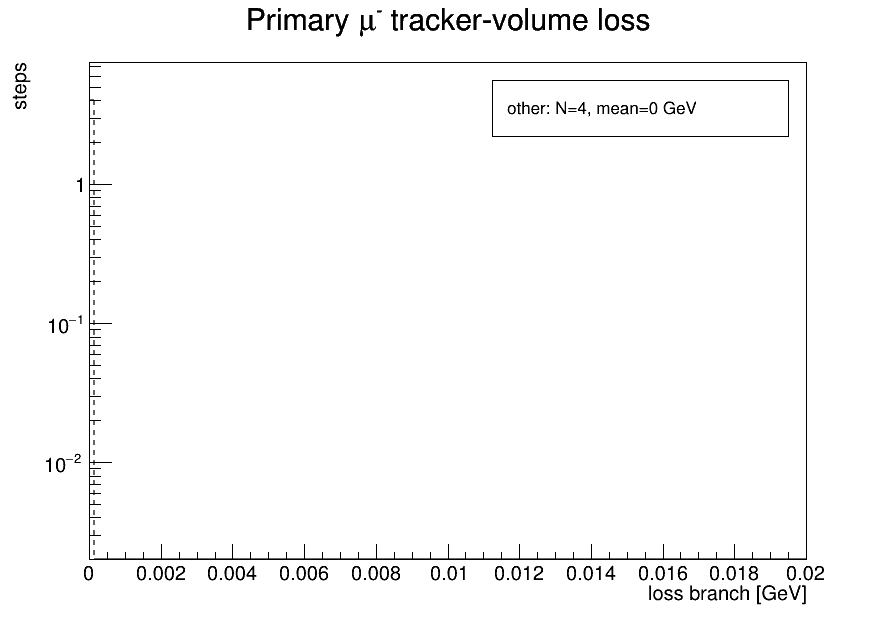

Reproduce with:

```bash
root -l -b -q 'G4MaterialStepComparison/studies/e1p0_theta85/scripts/plot_muon_tracker_process_loss_spectra.C("G4MaterialStepComparison/studies/e1p0_theta85")'
```
