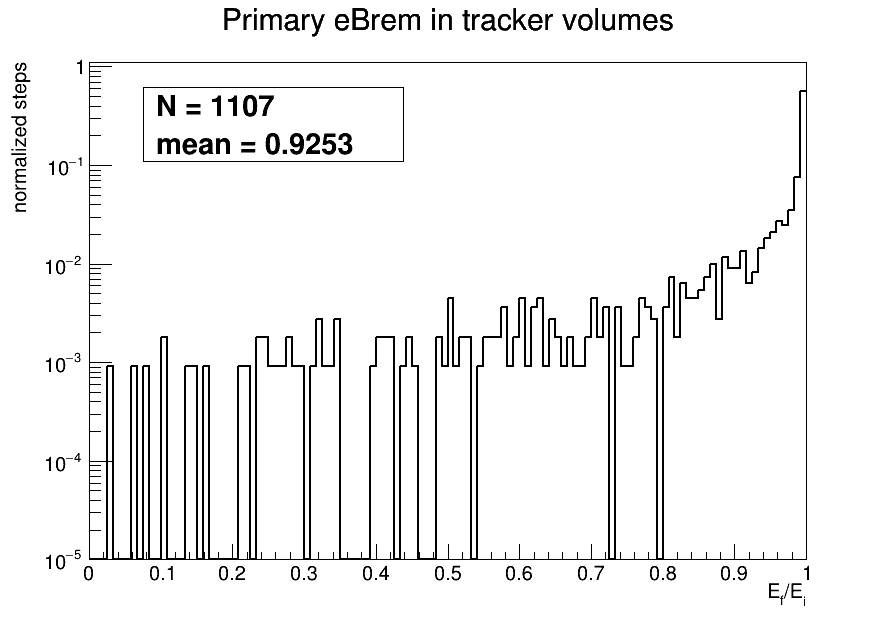

# 2 GeV, theta=85 deg Material-Step Study

This directory repeats the 1 GeV, theta=85 deg material-step procedure for the 2 GeV electron and muon tuples.

Input tuples in the CEPCSW top directory:

```text
gsf_material_steps-e--2.0-85-{1..15}.root
gsf_material_steps-mu--2.0-85-{1..15}.root
```

The ROOT tuples are not copied here. This directory contains only analysis scripts, generated summaries, and plots.

## Directory Contents

- `scripts/`: ROOT macros used for this study point.
- `plots/`: generated PNG/PDF figures.
- `summary.txt`: electron eBrem track-id and radius summary.
- `category_energy_loss_summary.txt`: primary eBrem energy-loss summaries for BGO crystal bars, tungsten beampipe shell, and other tracker volumes.
- `tracker_process_loss_summary.txt`: primary electron tracker-process loss spectra.
- `muon_tracker_process_loss_summary.txt`: primary muon tracker-process loss spectra.
- `tracker_electron_muon_ioni_summary.txt`: direct eIoni vs muIoni tracker comparison.

## Step-Wise Definitions

All selections are step-wise: a `g4step_tuple` entry is one event, and vector branch index `i` is one Geant4 step. The category is assigned from the values at the same step index `i`; it is not inferred from the event or whole track.

Primary selections:

- Electron: `track_id == 1 && parent_id == 0 && pdg == 11`
- Muon: `track_id == 1 && parent_id == 0 && pdg == 13`

Process selections:

- Electron bremsstrahlung: `process_subtype == 3` in the electron sample (`eBrem`).
- Electron ionization: `process_subtype == 2` in the electron sample (`eIoni`).
- Muon ionization: `process_subtype == 2` in the muon sample (`muIoni`).

Tracker-volume selections use `pre_volume` names containing one of `VXD`, `ITK`, `TPC`, `OTK`, `SIT`, or `SET`. Energy-loss spectra use the tuple `loss` branch in GeV.

The mutually exclusive primary eBrem material categories are:

- `crystal_bar`: `material == G4_BGO` and `pre_volume` starts with `bar_s` or contains `crystal_s`.
- `w_beampipe_shell`: `material == G4_W` and `pre_volume` contains `BeamPipe_BeforeCryoW`.
- `other_tracker`: tracker-named `pre_volume`, excluding the previous categories.

## Reproduction

Run from the CEPCSW top directory:

```bash
root -l -b -q 'G4MaterialStepComparison/studies/e2p0_theta85/scripts/analyze_ebrem_trackid_r.C("G4MaterialStepComparison/studies/e2p0_theta85")'
root -l -b -q 'G4MaterialStepComparison/studies/e2p0_theta85/scripts/plot_ebrem_energy_loss_categories.C("G4MaterialStepComparison/studies/e2p0_theta85")'
root -l -b -q 'G4MaterialStepComparison/studies/e2p0_theta85/scripts/plot_tracker_process_loss_spectra.C("G4MaterialStepComparison/studies/e2p0_theta85")'
root -l -b -q 'G4MaterialStepComparison/studies/e2p0_theta85/scripts/plot_muon_tracker_process_loss_spectra.C("G4MaterialStepComparison/studies/e2p0_theta85")'
root -l -b -q 'G4MaterialStepComparison/studies/e2p0_theta85/scripts/plot_electron_muon_ioni_tracker_loss.C("G4MaterialStepComparison/studies/e2p0_theta85")'
```

## Current Results

These numbers use the full currently available sample:

```text
gsf_material_steps-e--2.0-85-{1..15}.root: 3500 events
gsf_material_steps-mu--2.0-85-{1..15}.root: 3500 events
```

Electron eBrem track-id continuity:

```text
all_eBrem_steps                 2979904
all_eBrem_same_track_after      2971381
all_eBrem_no_same_track_after      8523
primary_eBrem_steps              128475
primary_eBrem_same_track_after   128459
primary_eBrem_no_same_track_after    16
```

The primary eBrem `track_id` therefore almost always continues after the eBrem step. The few no-same-track cases are edge cases where no later same-track step is recorded.

Primary eBrem radius distribution:

```text
primary_eBrem_R_mid_mm mean 1807.51
q01/q05/q10/q50/q90/q99 = 107.58 / 1831.29 / 1836.20 / 1852.59 / 1879.02 / 1913.38 mm
R~100 primary eBrem count = 712
R~100 midR q10/q50/q90 = 70.13 / 92.88 / 108.88 mm
R~100 midZ q10/q50/q90 = 6.15 / 739.28 / 955.45 mm
```

The dominant primary eBrem population is still near `R = 1.8-1.9 m`. The small-radius population is dominated by forward/MDI material:

```text
G4_W             281
stainless_steel 256
CFRP_M55J       108
LYSO             29
Air              19
CrZrCu18150      16
G4_Al             2
Polyimide_ITK     1
```

Primary eBrem category loss summaries:

```text
crystal_bar       count 120945  frac_loss_mean 0.117853  abs_loss_GeV_mean 0.048926
w_beampipe_shell  count    281  frac_loss_mean 0.167001  abs_loss_GeV_mean 0.023209
other_tracker     count   3774  frac_loss_mean 0.072882  abs_loss_GeV_mean 0.109965
```

Primary electron tracker-process retained-fraction spectra use `E_f/E_i = post_p/pre_p` and are shape-normalized:

```text
tracker_Ef_over_Ei_count       3774  mean 0.927118  q10 0.754791  q50 0.995559  q90 0.999912
tracker_eIoni_Ef_over_Ei_count 69611 mean 0.999588  q10 0.999970  q50 0.999998  q90 0.999999
```




The normalized histograms are saved for downstream studies in:

```text
plots/primary_tracker_ebrem_Ef_over_Ei_shape.root        h_primary_tracker_ebrem_Ef_over_Ei_shape
plots/primary_tracker_eioni_Ef_over_Ei_shape.root        h_primary_tracker_eioni_Ef_over_Ei_shape
plots/primary_tracker_ebrem_eioni_Ef_over_Ei_shape.root  h_primary_tracker_ebrem_Ef_over_Ei_shape, h_primary_tracker_eioni_Ef_over_Ei_shape
```

Tracker-only primary electron process loss summaries:

```text
eBrem           count    3774  mean 0.12384662 GeV  q50 0.00563061  q90 0.38432580
eIoni           count   69611  mean 0.00005356 GeV  q50 0.00000262  q90 0.00001311
msc             count     619  mean 0.00002984 GeV  q50 0.00001369  q90 0.00005054
StepLimiter     count   43732  mean 0.00000364 GeV  q50 0.00000235  q90 0.00000370
Transportation  count 2324127  mean 0.00000509 GeV  q50 0.00000072  q90 0.00001073
```

Tracker-only primary muon process loss summaries:

```text
muIoni          count   56527  mean 0.00006835 GeV  q50 0.00000238  q90 0.00001359
StepLimiter     count   23026  mean 0.00000187 GeV  q50 0.00000167  q90 0.00000286
Transportation  count 2081477  mean 0.00000484 GeV  q50 0.00000048  q90 0.00001073
other           count       4  mean 0.00015390 GeV
```

Direct tracker ionization comparison:

```text
eIoni  count 69611  mean 0.00005356 GeV  q50 0.00000262  q90 0.00001311  q99 0.00089476
muIoni count 56527  mean 0.00006835 GeV  q50 0.00000238  q90 0.00001359  q99 0.00102888
```

At 2 GeV, the electron and muon tracker ionization spectra remain similar in the central and high-percentile regions. The electron sample has more ionization steps, while the muon mean `loss` is slightly larger in this expanded tracker-only selection.
