# LCIO Track Resolution: 2 GeV, theta=85 deg

This study compares the standard LCIO `CompleteTracks` reconstruction performance for the 2 GeV, theta=85 deg electron and muon samples.

Input files in the CEPCSW top directory:

```text
trk-e--2.0-85-{1..10}.root
trk-mu--2.0-85-{1..10}.root
```

The input ROOT files are generated tracking outputs and are not copied into this analysis directory.

## Method

The analyzer reads the PODIO `events` tree with uproot.

Track selection:

- Reconstructed track collection: `CompleteTracks`
- Matching: use `CompleteTracksParticleAssociation` to select the reconstructed track associated with primary `MCParticle` index 0 when available
- Fallback: if no valid association is found, select the `CompleteTracks` entry with the largest `ndf`
- Track state: LCIO `TrackState` with `location == 1`, which has reference point `(0,0,0)` in these files

Truth definition:

- Primary generated particle: `MCParticleGen[0]`
- `D0` truth and `Z0` truth are taken as zero for these particle-gun IP samples
- `phi` and `tan(lambda)` truth are computed from generated momentum
- `omega` truth uses `omega = q * 0.0003 * B / pT`, with `B = 3.0 T` and `omega` in `1/mm`

The output rows are stored in `track_resolution_rows.csv`; summary statistics are in `track_resolution_summary.csv` and `summary.txt`. Tail fractions are also written to `track_resolution_tail_summary.csv`.

## Reproduction

Run from the CEPCSW top directory:

```bash
TrackingPerformanceStudies/lcio_track_resolution_2p0_theta85/scripts/build_electron_ebrem_categories.py
TrackingPerformanceStudies/lcio_track_resolution_2p0_theta85/scripts/analyze_lcio_track_resolution.py
```

## Plots

Each plot overlays electron in black and muon in blue, normalized to unit area.

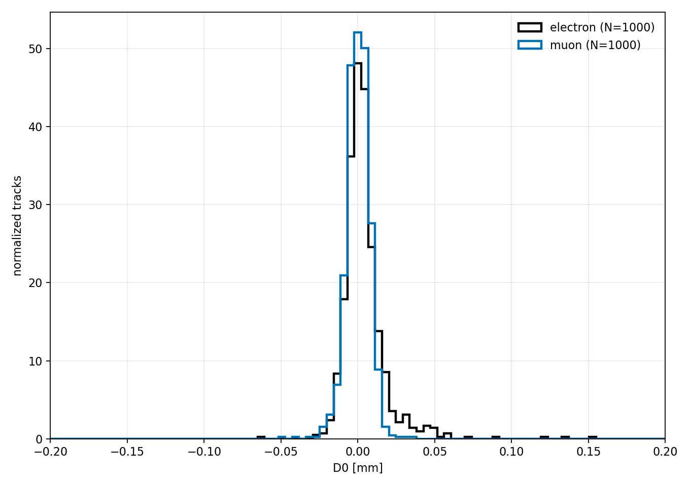

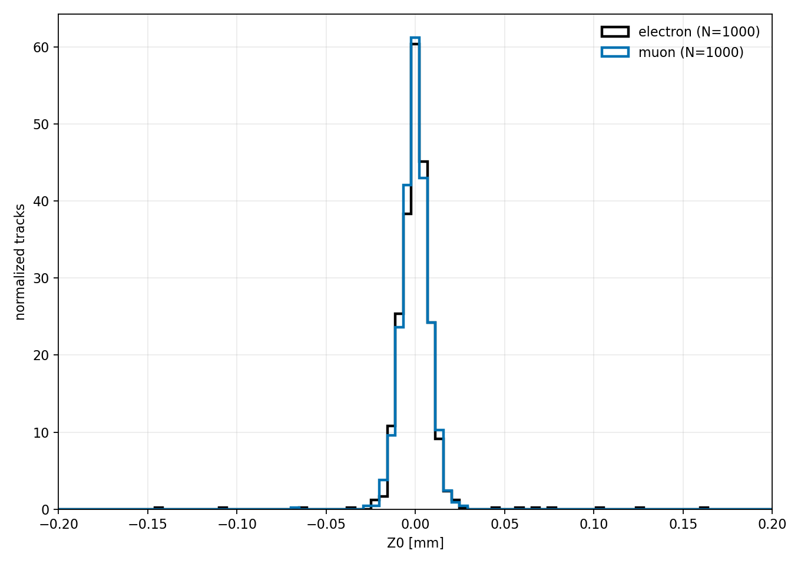

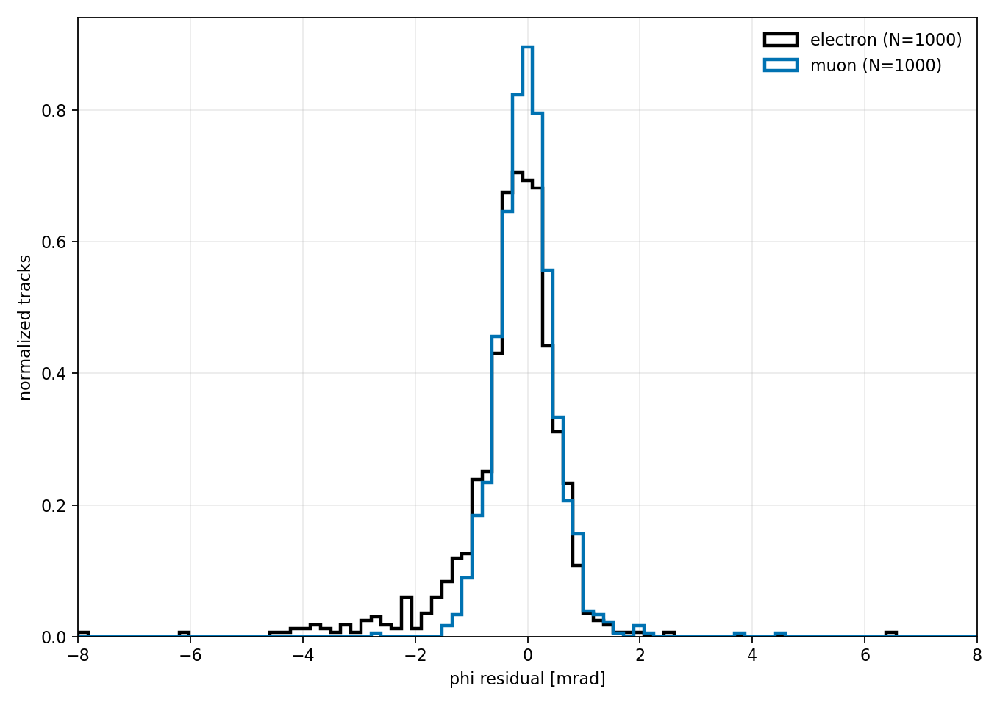

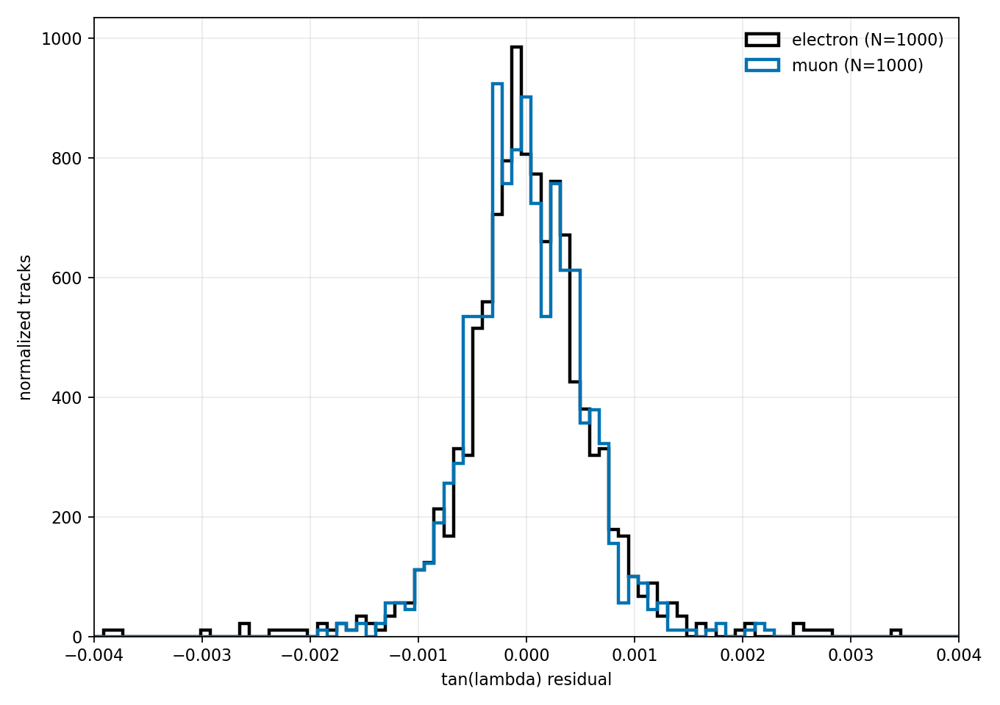

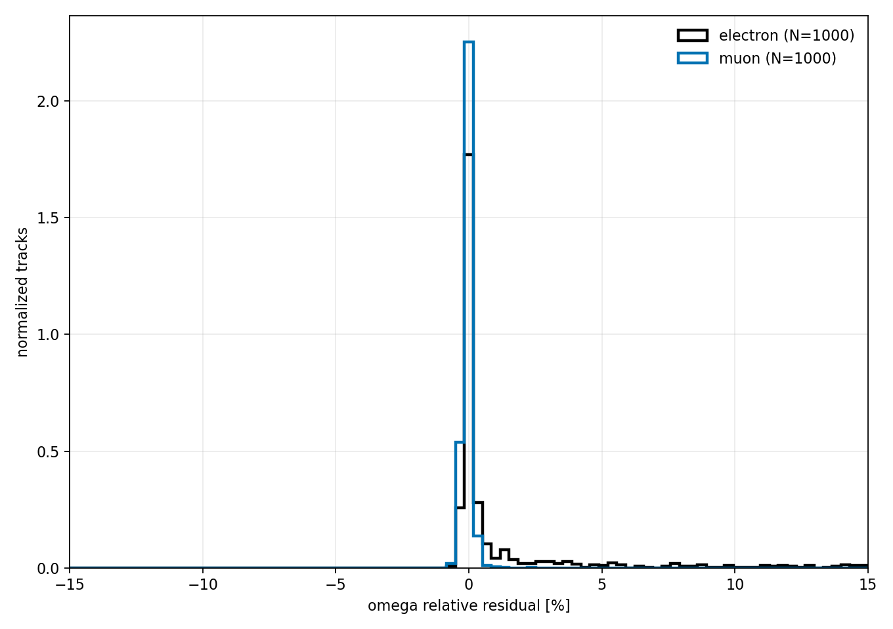

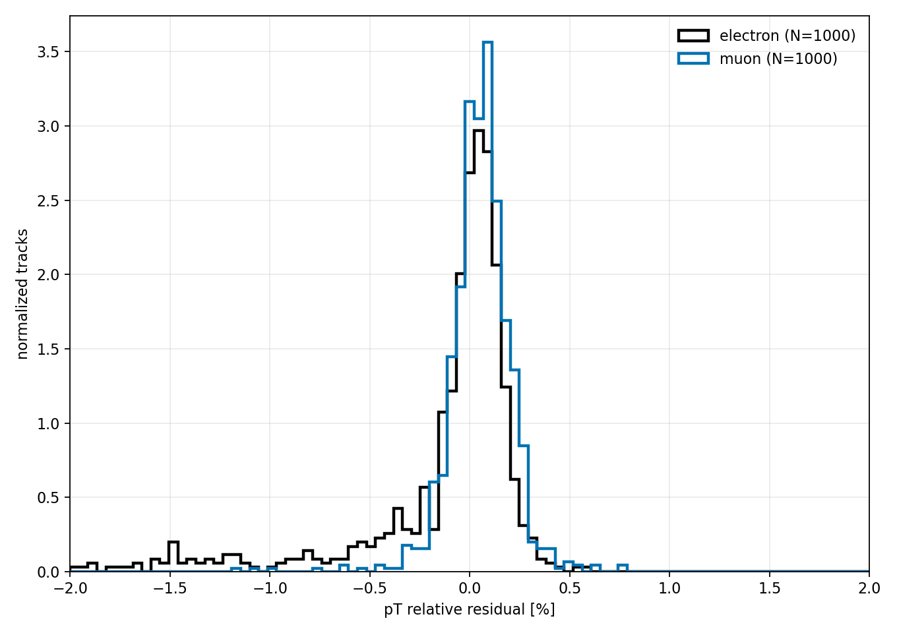

The pT residual plot is zoomed to `[-2%, 2%]` to show the core resolution; the larger electron tails are quantified separately below.

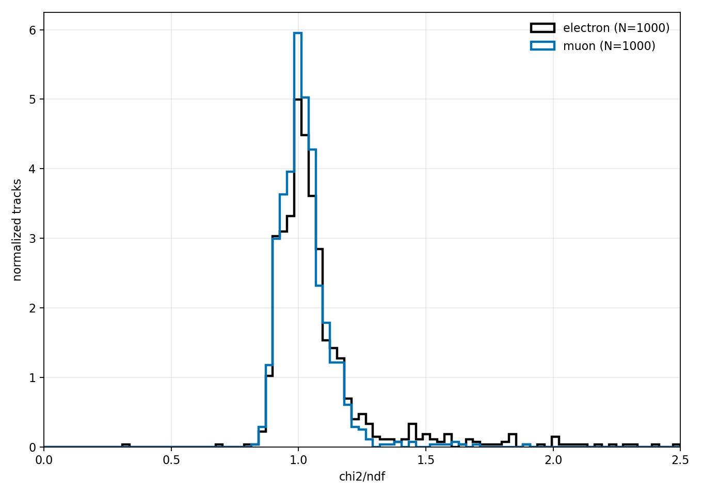


## Electron eBrem Categories

The electron events are also classified with the material-step tuples:

```bash
TrackingPerformanceStudies/lcio_track_resolution_2p0_theta85/scripts/build_electron_ebrem_categories.py
```

This writes `electron_ebrem_event_categories.json`. The JSON is joined to the tracking rows by `(file_index, entry_index)`, which corresponds to `trk-e--2.0-85-{file_index}.root` and the event entry in that file.

Primary eBrem selection in the material-step tuple:

```text
track_id == 1 && parent_id == 0 && pdg == 11 && process_subtype == 3
```

Hard eBrem is defined as either `max_single_frac_loss >= 0.10` or `cumulative_frac_loss >= 0.10`, where `frac_loss = 1 - post_p/pre_p`. All-material primary eBrem is hard for all 1000 electron events at this point, so the useful tracking split is the tracker-volume category:

```text
no_tracker_ebrem     368
light_tracker_ebrem  458
hard_tracker_ebrem   174
```

The tracking CSV contains these category columns, and `track_resolution_by_tracker_ebrem_summary.csv` stores the category-split resolution summaries.

Electron-only tracker-eBrem split plots:

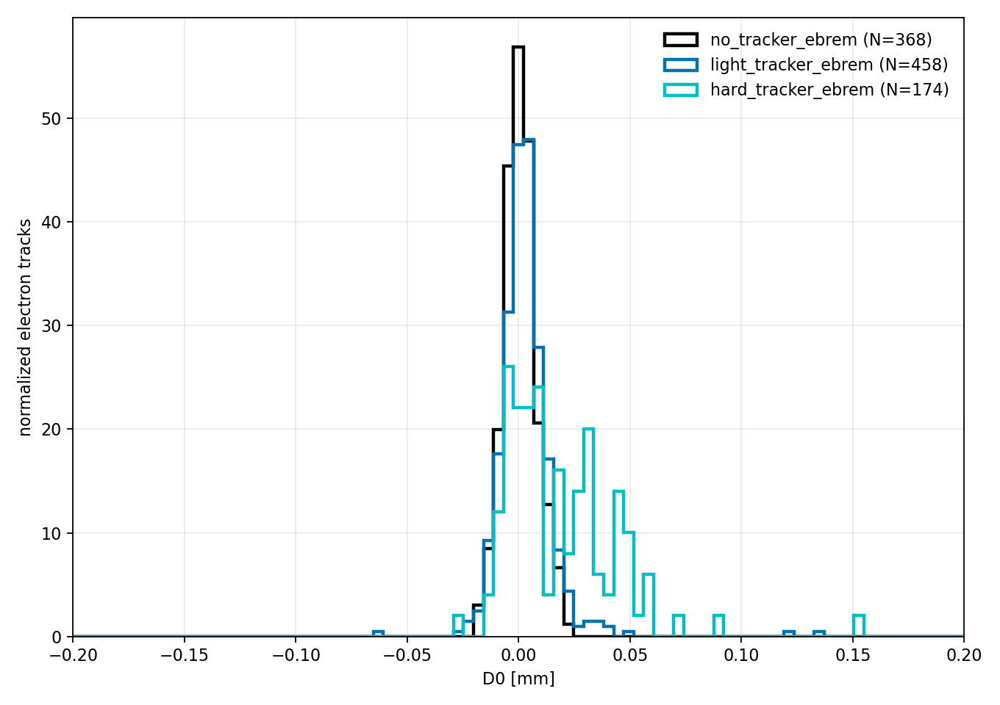

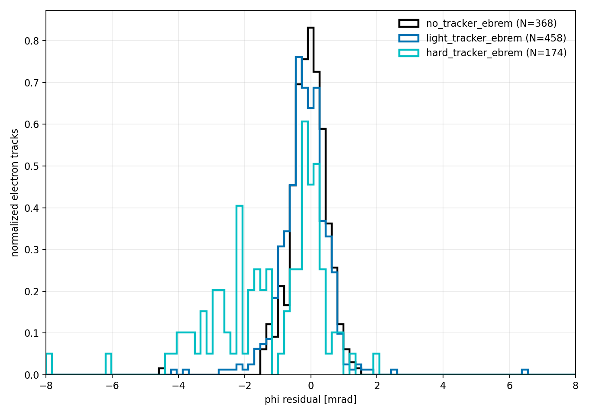

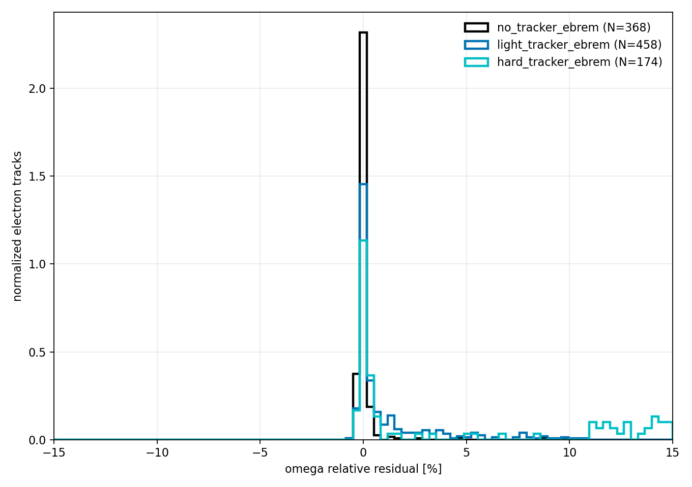

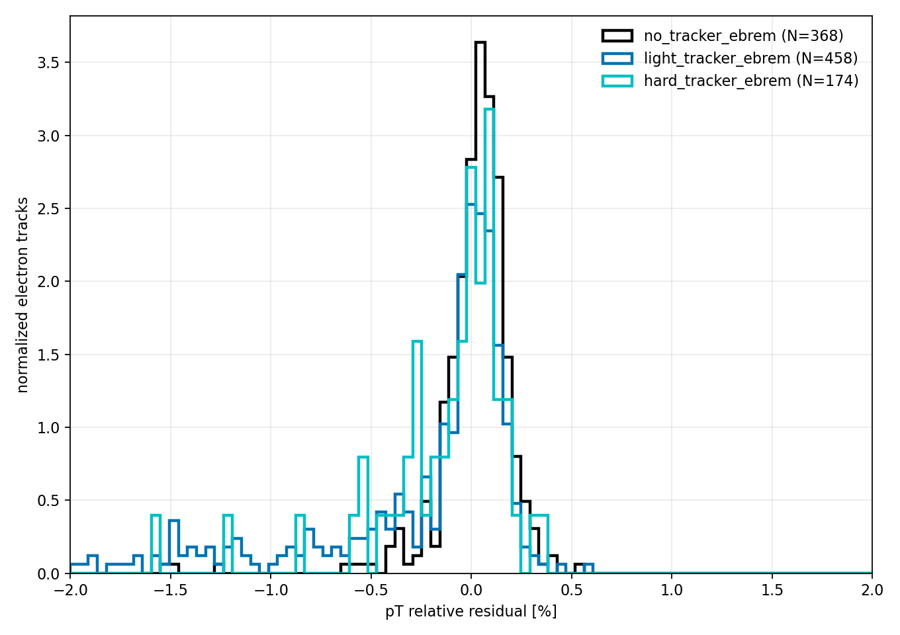

## Current Results

Both samples have 1000 matched tracks.

Central 68% interval, from q16 to q84:

```text
electron D0        -0.0055 to 0.0172 mm
muon     D0        -0.0064 to 0.0072 mm

electron Z0        -0.0076 to 0.0084 mm
muon     Z0        -0.0071 to 0.0070 mm

electron phi       -1.1860 to 0.3641 mrad
muon     phi       -0.4857 to 0.4207 mrad

electron tanLambda -4.739e-4 to 5.140e-4
muon     tanLambda -4.844e-4 to 4.768e-4

electron omega     -0.115% to 5.332%
muon     omega     -0.184% to 0.064%

electron pT        -5.062% to 0.115%
muon     pT        -0.064% to 0.184%
```

The muon sample has narrow, nearly Gaussian residuals. The electron sample has a comparable central core in impact parameters and `tan(lambda)`, but much larger non-Gaussian tails, especially in curvature/momentum:

```text
electron |pT residual| > 10%: 124 / 1000
electron |pT residual| > 50%:  31 / 1000
muon     |pT residual| > 10%:   0 / 1000
muon     |pT residual| > 50%:   0 / 1000
```

The electron mean/RMS values are therefore dominated by tail failures from bremsstrahlung and difficult pattern/fit cases. For tuning or monitoring the standard LCIO track performance, use both the robust q16/q50/q84 core metrics and the explicit tail fractions.
